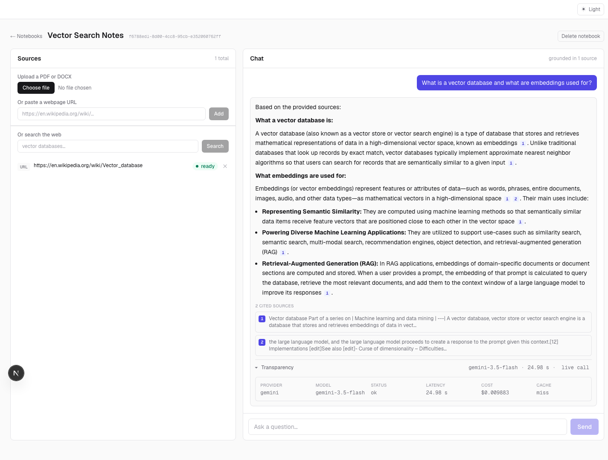

# NotebookLM-Style RAG Chat, on a Self-Built LLM Gateway

A notebook-scoped Retrieval-Augmented Generation chat app. Create a "notebook,"
add sources (PDF/DOCX upload or a pasted URL), and chat with an assistant that
answers **only** from those sources, with inline citations back to the exact
retrieved chunk.

The part worth looking at is underneath: **every LLM call goes through a gateway
I built** — provider fallback, response caching, and per-call cost/latency
logging — and the UI exposes that plumbing per message instead of hiding it.



<sub>Light and [dark](docs/screenshot-dark.png) themes; the transparency row expands to show provider, model, status, latency, cost, and cache result.</sub>

## Why a gateway layer?

Calling a provider SDK directly from a request handler works right up until it
doesn't. The failure modes are boring and guaranteed: the provider rate-limits
you, a model gets retired out from under you, latency spikes, or you ship a
feature and discover a month later what it costs per user.

So no caller in this codebase touches a provider SDK. They call:

```python
gateway.call_llm(prompt: str, notebook_id: str) -> LLMResult
```

and the gateway owns the messy parts:

| Concern | How it's handled |
|---|---|
| **Redundant spend** | `(notebook_id, normalized_prompt)` is hashed into a Postgres cache table. A hit returns in ~2 ms at $0.00 and never touches a provider. A **semantic** layer also matches paraphrases via the query embedding, gated on the retrieved chunks being identical. |
| **Provider failure** | Timeout / 5xx / rate-limit on the primary retries once against a fallback provider, and the call is logged with `status="fallback"`. |
| **Cost blindness** | Every call writes a row to `llm_calls`: provider, model, tokens, computed USD cost, latency, cache hit. The transparency panel reads from the same data. |
| **Vendor lock-in** | Providers are adapters behind a `Provider` protocol. Swapping Gemini for Groq is a config change, not a refactor. |
| **Total failure** | If both providers fail, the gateway still logs an `error` row and raises a typed exception the API turns into a real user-facing message. |

This is deliberately the boring, observable version of an LLM integration — the
kind you can debug at 2am from a database table.

## Architecture

```
      Browser
         │
         ▼
┌──────────────────────┐   Vercel
│  Next.js (App Router)│   ─ notebook list / detail
│  TypeScript+Tailwind │   ─ citation chips, transparency panel
└──────────┬───────────┘   ─ polls source status until `ready`
           │ JSON over HTTPS (CORS-scoped)
           ▼
┌──────────────────────────────────────────────────┐   Render
│                FastAPI                            │
│                                                   │
│  /notebooks            /notebooks/{id}/sources    │
│  /notebooks/{id}/chat  ── the RAG flow ──┐        │
│                                          │        │
│  ┌───────────────────────────────────────▼─────┐  │
│  │ 1. embed query      sentence-transformers   │  │
│  │                     all-MiniLM-L6-v2 (384d) │  │
│  │                     ── runs in-process ──   │  │
│  │ 2. top-k=5 cosine search  (pgvector <=>)    │  │
│  │ 3. build prompt, chunks labelled [S1]..[S5] │  │
│  │ 4. gateway.call_llm() ───────────┐          │  │
│  │ 5. parse cited markers → chunk_ids│         │  │
│  └───────────────────────────────────┼─────────┘  │
│                                      ▼            │
│  ┌─────────────────── LLM Gateway ──────────────┐ │
│  │  cache lookup ──hit──▶ return (~2ms, $0.00)  │ │
│  │       │ miss                                 │ │
│  │       ▼                                      │ │
│  │  primary ──429/5xx/timeout──▶ fallback       │ │
│  │       │ ok                        │ ok       │ │
│  │       ▼                           ▼          │ │
│  │  write cache + log llm_calls row             │ │
│  │       │ both fail                            │ │
│  │       ▼  log error row, raise GatewayError   │ │
│  └───────────────┬──────────────────────────────┘ │
└──────────────────┼────────────────────────────────┘
                   │                    │
                   ▼                    ▼
      ┌────────────────────┐   ┌──────────────────┐
      │ Postgres + pgvector│   │  Gemini / Groq   │
      │      (Neon)        │   │   HTTPS APIs     │
      │                    │   └──────────────────┘
      │ notebooks  sources │
      │ chunks     chat_messages
      │ llm_calls  llm_cache
      └────────────────────┘
```

**Ingestion** runs as a FastAPI background task: parse (`pypdf` / `python-docx` /
`trafilatura`) → chunk (~500 tokens, 50 overlap) → embed locally → store. The
source row flips `pending → processing → ready|failed`, and the UI polls until
it settles.

**Streaming.** `POST /notebooks/{id}/chat/stream` emits Server-Sent Events —
`token` deltas as the model generates, then one `done` event carrying the exact
same payload as the buffered endpoint (citations and cost are only knowable once
generation ends). Two details make it feel live: Gemini's *thinking* phase is
disabled (`GEMINI_THINKING_BUDGET=0`), which cuts time-to-first-token from ~4.8s
to ~0.9s, and the client re-paces chunky provider deltas into a character-by-
character reveal. Fallback is only attempted **before** the first token — once
bytes are on the wire, splicing in a second provider's answer would contradict
what the user already read.

**Auth** (optional, `GOOGLE_CLIENT_ID`) is Google sign-in with real per-user
isolation: notebooks belong to a `users` row and every query is scoped to the
caller. The frontend uses Auth.js and sends Google's ID token as
`Authorization: Bearer …` — a header rather than a cookie because Vercel and
Render are separate origins. Leave the client id unset and the API runs as a
`local-dev` user, so the app works with no OAuth setup.

**Conversation memory.** The last `CHAT_HISTORY_TURNS` messages are replayed
into the prompt so follow-ups resolve ("what are *its* benefits?"). The
transcript itself rehydrates from `GET /notebooks/{id}/messages`, which rejoins
`llm_calls` so restored assistant turns keep their provider, model, latency,
cost, and cache status.

**Web search** (optional, `TAVILY_API_KEY`) is *source discovery only*: search,
tick the results you want, and they're added as ordinary `url` sources through
that same pipeline. Retrieval and citations are untouched — everything the model
cites is still a row in `chunks`. Without a key the endpoint returns 503 and the
UI hides the search box.

**Gateway stats** (`/stats`) is SPEC's "aggregate gateway-stats page" stretch
item — every number reads straight from `llm_calls`: total spend, cache hit
rate, p50/p95 latency, breakdown by provider/model/status, a 30-day trend, and
top notebooks by spend. Charts are hand-built SVG (no charting dependency),
built to a data-visualization method: fixed categorical color order validated
for colorblind-safety and contrast (`node scripts/validate_palette.js`), a
reserved status palette (never doubling as a series color), one axis per
chart (never dual-axis — cost and call volume are two separate charts), and a
hover crosshair on every line.

**Notebook rename** — `PATCH /notebooks/{id}`, inline-editable in the header
(click the title). **Multi-file upload** and **web-search batch-add** both
fire N independent `POST /sources` calls via `Promise.allSettled`, so a
partial failure doesn't lose the sources that succeeded. **Stop generating**
aborts the client-side fetch and keeps whatever text streamed so far as a
"stopped" message — the in-flight provider call still finishes server-side and
is still logged to `llm_calls` (tokens already billed can't be un-spent),
only the client stops rendering further tokens.

## Tests

```bash
cd backend
pip install -r requirements-dev.txt
python -m pytest -q      # run via `python -m`, not a bare `pytest`, so cwd is on sys.path
```

47 tests, no network calls, real local Postgres (deliberately not mocked — the
gateway's value IS what it writes to the database). `tests/test_gateway.py` is
the core suite: fake providers exercise every SPEC branch — cache hit skips
the provider, a retryable failure falls over, a fatal error never retries, a
mid-stream failure raises instead of splicing two answers together, and the
semantic cache's 0.97 threshold behaves as measured. `test_rag.py` and
`test_websearch.py` cover parsing; `test_api.py` smoke-tests routing and
ownership in auth-disabled mode.

## Tech Stack

| Layer | Choice |
|---|---|
| Backend | Python 3.12, FastAPI, SQLAlchemy 2, Alembic |
| Frontend | Next.js 16 (App Router), TypeScript, Tailwind v4 |
| Database | Postgres 16 + `pgvector` (HNSW, `vector_cosine_ops`) |
| Embeddings | `sentence-transformers` / `all-MiniLM-L6-v2`, local, 384-dim |
| LLM | Gemini (primary + fallback), Groq adapter (OpenAI-API-compatible, free tier) |

## Local setup

**Prerequisites:** Docker, Python 3.12, Node 20+.

```bash
# 1. Postgres + pgvector
docker compose up -d
docker exec notebooklm_rag_db psql -U rag -d rag \
  -c "SELECT extname FROM pg_extension WHERE extname='vector';"

# 2. Backend
cd backend
python3.12 -m venv .venv && source .venv/bin/activate
pip install -r requirements-ingest.txt   # includes torch; ~1.3 GB installed
cp .env.example .env                     # fill in GEMINI_API_KEY
alembic upgrade head
uvicorn app.main:app --reload            # http://localhost:8000

# 3. Frontend (new shell)
cd frontend
npm install
cp .env.example .env.local               # NEXT_PUBLIC_API_BASE_URL
npm run dev                              # http://localhost:3000
```

Smoke-test the whole path:

```bash
curl http://localhost:8000/health
curl -X POST http://localhost:8000/notebooks \
  -H 'Content-Type: application/json' -d '{"title":"Demo"}'
```

> The first request after boot loads the embedding model (~10 s). The app warms
> it during FastAPI startup so no user request pays that cost.

## Deploying

The full checklist for **Neon + Render + Vercel** — including pushing this
repo to GitHub, which it doesn't have a remote for yet — lives in
[`DEPLOYMENT.md`](DEPLOYMENT.md). Config lives in [`render.yaml`](render.yaml)
and [`frontend/vercel.json`](frontend/vercel.json); no secrets are committed —
every secret is marked `sync: false` and set in the provider dashboard.

## Known limitations

These are real, measured constraints — not hypotheticals.

**The fallback provider's free tier has real rate limits.** Groq's free tier
is genuinely free (no card, resets daily) — but caps out at 30 requests/min,
1,000/day, and 12,000 tokens/min on the default model. Fine for a rarely-
invoked fallback on a portfolio-scale app; the first thing to break under any
real production load. An earlier attempt used Kimi (Moonshot AI) in this slot
— also OpenAI-API-compatible, but it turned out to require a paid recharge
despite looking free, which is why Groq replaced it.

**Free-tier cold starts compound.** Render free services spin down after ~15
minutes idle; the next request pays a container start *plus* loading the
embedding model into memory. Neon's compute also scales to zero. A first
request to a cold stack can take 30–60 s, and the transparency panel will
honestly report that latency. Warm requests are ~3–14 s, dominated by the
provider call.

**Concurrent embedding calls are serialized on purpose.** Two threads calling
`SentenceTransformer.encode()` at once reproducibly **segfaults the whole
process** on this machine's PyTorch MPS (Apple GPU) backend — confirmed by
direct reproduction, not a guess. Multi-file upload and multi-URL add both
fire several ingestion background tasks at once, and a chat request's query
embedding can already overlap with an in-flight ingestion — all of which call
into the same shared model instance. `app/embeddings.py` wraps every
`model.encode()` call in a lock (`_encode_lock`) so calls queue instead of
racing. The cost is negligible (MiniLM inference is milliseconds) and the
alternative is a crashed server, so this is a permanent fix, not a workaround
to revisit.

**Local embeddings are a real trade-off.** `all-MiniLM-L6-v2` costs nothing per
call, sends no document text to a third party, and is fast enough on CPU — but
it pulls PyTorch into the deployment (~529 MB installed, and the default Linux
wheel drags in ~2 GB of CUDA packages you must actively opt out of; see
`requirements-render.txt`). It also fits awkwardly in Render's 512 MB free
tier — that's the most likely thing to break on a free deploy. And 384-dim
MiniLM retrieves noticeably worse than a larger embedding model on nuanced
queries.

**Retrieval is single-shot.** Top-k=5 cosine, no reranking, no query rewriting,
no multi-hop. A question whose answer is split across seven chunks will get five
of them.

**The semantic cache only catches near-paraphrases.** MiniLM similarity here is
dominated by lexical overlap, not question intent, and the safe threshold is
narrow. Measured against *"What is retrieval-augmented generation?"*:

| Similarity | Query | Wanted |
|---|---|---|
| 0.976 | "what is retrieval augmented generation" | hit |
| 0.972 | "Can you explain what retrieval-augmented generation is?" | hit |
| **0.965** | **"How does retrieval-augmented generation work?"** | **miss** — different question |
| 0.848 | "Explain retrieval-augmented generation" | (misses) |
| 0.13 | "What's RAG?" | (misses — MiniLM doesn't equate the acronym) |

Only 0.007 separates the last wanted hit from the first wanted miss, so the
threshold sits at 0.97 and anything looser starts serving wrong answers. It
reliably absorbs punctuation and light rewording; it will not match acronyms. A
larger or instruction-tuned embedding model would widen that margin.

**Semantic hits ignore conversation history.** The exact-match key covers the
full prompt including replayed turns, but the semantic key is
`(chunks, query embedding)` only — including history would make the feature dead
code, since every turn has a different history. The trade-off is that a
paraphrased *follow-up* whose meaning depends on the conversation could match an
earlier one asked in a different context.

**A retired primary model does not trigger fallback.** Per spec, failover fires
on timeout/5xx/rate-limit. A `404 model not found` is classified fatal, so it
surfaces as an error instead of failing over — which is exactly what happened
when Google retired `gemini-2.5-flash` for new API keys mid-project.

**Single-user by design.** No auth, no tenancy, no rate limiting. Anyone who can
reach the API can read and write every notebook. See SPEC.md "Non-goals."

## Repository layout

```
.
├── backend/
│   ├── app/
│   │   ├── gateway.py      ← fallback, caching, cost/latency logging
│   │   ├── providers.py    ← Gemini/Groq adapters + error taxonomy
│   │   ├── rag.py          ← retrieval, prompt build, citation parsing
│   │   ├── ingestion.py    ← parse → chunk → embed → store
│   │   ├── models.py       ← SQLAlchemy models (mirrors SPEC data model)
│   │   └── routers/        ← notebooks, sources, chat
│   ├── alembic/            ← migrations (creates the pgvector extension)
│   ├── requirements-ingest.txt   ← local dev (torch from PyPI)
│   └── requirements-render.txt   ← production (CPU-only torch)
├── frontend/src/
│   ├── app/                ← App Router pages
│   ├── components/         ← SourcesPanel, ChatPanel, citations, transparency
│   └── lib/                ← typed API client, source-polling hook
├── DEPLOYMENT.md
├── render.yaml
└── docker-compose.yml
```

`Mem-Claude/SPEC.md` is the original project spec and remains the source of truth for
scope; where the implementation deviates (model IDs, mainly), the deviation is
commented at the site.
