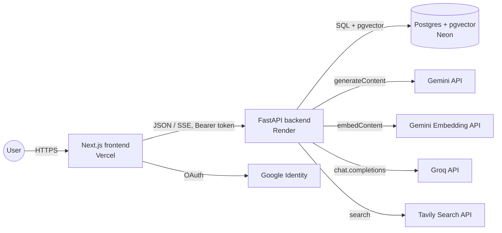
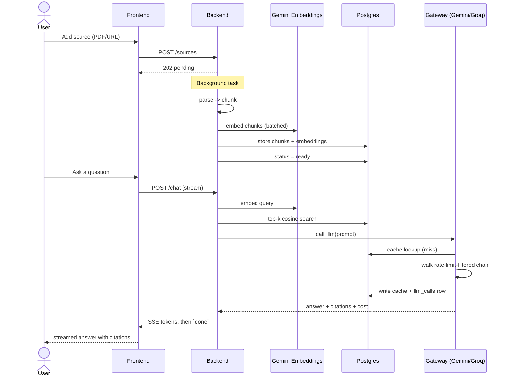
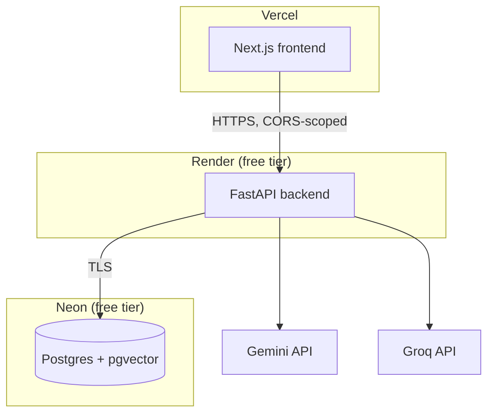

# High-Level Design — Sourcery

## 1. Purpose

Sourcery is a notebook-scoped Retrieval-Augmented Generation (RAG) chat
application: a user creates a "notebook," adds sources (PDF/DOCX uploads,
pasted URLs, or web-search results), and chats with an assistant that
answers **only** from those sources, with inline citations back to the exact
retrieved chunk.

The system is deliberately built around a second concern that sits
underneath the RAG feature itself: **every LLM call is routed through a
self-built gateway** that owns caching, multi-provider fallback, rate-limit
awareness, and per-call cost/latency logging — and that plumbing is exposed
in the UI (a per-message transparency panel, a stats dashboard) rather than
hidden behind the chat bubble.

## 2. Goals

- Answer questions **grounded** in user-supplied sources, with verifiable
  citations — never an ungrounded model answer presented as fact.
- Survive the real failure modes of calling third-party LLM/embedding APIs:
  rate limits, transient 5xx/timeouts, a model being retired, a provider's
  free tier changing shape mid-project.
- Make LLM cost and latency **observable**, not just billed. Every call is a
  row in the database, not a number that only exists in a vendor dashboard.
- Run entirely on free-tier infrastructure (Vercel + Render + Neon +
  Gemini/Groq free tiers) without requiring the user to provision anything
  beyond a few API keys.
- Ship real auth (Google sign-in) with per-user data isolation, while still
  working with zero configuration in local-dev mode.

## 3. Non-goals

(See `Mem-Claude/SPEC.md` "Non-goals" for the authoritative list; summarized
here for context.)

- Multi-tenant **rate-limit** isolation — auth gives per-user data isolation,
  but the LLM/embedding API quotas are shared account-wide across every user
  of a deployment (see `docs/FUTURE_SCOPE.md`).
- Multi-turn agentic tool use, multi-hop retrieval, or query rewriting —
  retrieval is a single top-k cosine search per turn.
- Real-time collaboration or notebook sharing between users.
- A production-scale, multi-region deployment. The system targets a
  portfolio/single-owner deployment on free-tier infrastructure, and several
  documented constraints (§8) are direct consequences of that choice.

## 4. System context

Five external systems, none of which the frontend talks to directly except
Google (for the OAuth handshake) — every other integration point is behind
the FastAPI backend, so the browser never holds a provider API key.

## 5. Major components

### 5.1 Frontend (Next.js 16, App Router, TypeScript, Tailwind v4)

- **Notebook list / detail pages** — CRUD, inline rename, source management.
- **`ChatPanel`** — buffered and streamed (SSE) chat, citation rendering,
  regenerate-answer, stop-mid-stream.
- **`SourcesPanel`** — upload/URL/web-search add flows, live ingestion
  progress polling, retry-on-failure.
- **`TransparencyPanel`** — per-message provider/model/status/latency/cost/
  cache-hit display.
- **Stats page** — cost/latency/cache-hit-rate charts (hand-rolled SVG, no
  charting library) and live rate-limit headroom per model.
- **`LandingPage` / `AuthGate`** — signed-out marketing page and the
  Google-sign-in gate; auth is entirely optional at the infrastructure level
  (see §5.4).

The frontend never imports a provider SDK and never sees a provider API key
— it only ever talks to the FastAPI backend.

### 5.2 Backend API (FastAPI, Python 3.12)

Routers, each a thin HTTP layer over the modules in §5.3-§5.6:

| Router | Responsibility |
|---|---|
| `notebooks` | CRUD, ownership checks (`owned_notebook`) |
| `sources` | Upload/URL add, list, delete, retry |
| `chat` | Buffered + streamed chat, message history, regenerate |
| `export` | Markdown export of a notebook's sources + transcript |
| `search` | Tavily web search (source discovery only) |
| `stats` | Aggregate gateway stats + rate-limit headroom |
| `auth` | `/auth/config`, `/auth/me` |

### 5.3 Ingestion pipeline (`app/ingestion.py`, `app/parsing.py`, `app/chunking.py`)

Runs as a FastAPI `BackgroundTask`, bounded by a semaphore
(`MAX_CONCURRENT_INGESTIONS`, default 2) so a burst of uploads can't exceed
the host's memory budget. Pipeline: **parse → chunk → embed → store**, with
a `sources.progress` column advancing through coarse checkpoints so the UI
can show real percentage rather than a spinner. See `docs/LLD.md` §3 for the
full state machine and memory-management measures (thread-count pinning,
`malloc_trim` after each source).

### 5.4 Auth (`app/auth.py`, frontend `AuthGate`/Auth.js)

Optional by design: `GOOGLE_CLIENT_ID` unset → every request resolves to a
sentinel `local-dev` user, and the frontend renders straight through with no
sign-in screen. Set it, and:

- The frontend obtains a Google ID token via Auth.js and sends it as
  `Authorization: Bearer <token>` (a header, not a cookie — Vercel and
  Render are different origins).
- The backend verifies the token's signature, expiry, issuer, and `aud`
  claim, then resolves/creates a `users` row keyed on the Google `sub`.
- Every notebook, source, chunk, and message is scoped to `users.id`;
  `owned_notebook()` 404s (not 403s) for another user's notebook, so
  existence can't be probed.
- A 401 from any request (expired/invalid token) triggers an automatic
  client-side sign-out back to the landing page, rather than leaving a raw
  error on screen.

### 5.5 RAG pipeline (`app/rag.py`)

Per chat turn: embed the query (`RETRIEVAL_QUERY` task type) → top-k=5
cosine search over `chunks.embedding` (pgvector HNSW index) → build a prompt
labelling each chunk `[S1]`..`[S5]` → hand off to the gateway → parse cited
`[S<n>]` markers back into chunk references for the citation UI.

### 5.6 LLM Gateway (`app/gateway.py`, `app/providers.py`, `app/rate_limits.py`)

The architectural centerpiece — see §7 for the design rationale and
`docs/LLD.md` §4 for the full sequence. In one sentence: **every LLM call
goes through one function** (`gateway.call_llm`/`stream_llm`) that owns
exact + semantic caching, a rate-limit-aware multi-provider fallback chain,
and cost/latency logging, so no caller ever touches a provider SDK directly.

### 5.7 Embeddings (`app/embeddings.py`)

Hosted, not local — `gemini-embedding-001` via the same API key used for
chat, batched up to the API's 100-texts-per-call ceiling, asymmetric
`RETRIEVAL_DOCUMENT`/`RETRIEVAL_QUERY` task types, output truncated to
768-dim (Matryoshka) from the native 3072. §8.3 covers why this replaced an
originally-local (`sentence-transformers`/MiniLM) design mid-project.

### 5.8 Data layer (Postgres 16 + pgvector, on Neon)

Seven tables: `users`, `notebooks`, `sources`, `chunks`, `chat_messages`,
`llm_calls`, `llm_cache`. Full schema in `docs/LLD.md` §2. Two HNSW vector
indexes (`chunks.embedding`, `llm_cache.query_embedding`) back the two
cosine-search paths (retrieval, semantic cache).

## 6. Key user flows (high level)

## 7. Key design decisions

| Decision | Rationale |
|---|---|
| **A single gateway function, not per-caller provider calls** | Centralizes caching, fallback, and cost logging in one place instead of every call site reinventing retry logic. Swapping/adding a provider is a config change, not a refactor (`Provider` protocol). |
| **Proactive rate-limit checks, not reactive 429 handling** | This account's Gemini free tier caps at 5 RPM / 20 RPD **per model** — tight enough that waiting for a 429 before failing over wastes a request against an already-exhausted quota. `app/rate_limits.py` checks logged usage in `llm_calls` before attempting a hop. |
| **Hosted embeddings over local** | Originally local (SPEC's choice, no per-call cost). Reversed after production confirmed the local stack's torch/MiniLM memory footprint exceeded Render's free 512MB ceiling for a single typical source, no concurrency involved. See §8.3. |
| **Exact + semantic response caching** | Exact-match (`(notebook_id, normalized_prompt)` hash) is unconditionally safe and cheap. Semantic (paraphrase) matching is a real quality/safety trade-off — currently disabled pending threshold remeasurement against the new embedding space (§8.4). |
| **Optional auth, sentinel local-dev user** | The same codebase runs identically whether or not `GOOGLE_CLIENT_ID` is set, so local development and a from-scratch deploy never require standing up OAuth first. |
| **Bearer token, not cookie, for auth** | Frontend (Vercel) and backend (Render) are different origins; a cross-site cookie would need `SameSite=None` plus credentialed CORS. A header is simpler and works identically in both dev and prod. |
| **Background-task ingestion with a concurrency semaphore** | Parsing/embedding is not instant, and a memory-constrained host can't run unbounded sources in parallel. Bounding concurrency (not just per-request memory) is what actually fixed a real production OOM. |

## 8. Constraints and known limitations

(Full detail in README.md "Known limitations"; summarized for design
context.)

1. **Every model in the fallback chain has a real, tight quota** — Gemini
   Flash models cap at 20 requests/day *each* on this account. A busy day
   can exhaust the entire 5-hop chain; the gateway then returns 429 rather
   than a generic failure.
2. **Free-tier cold starts** — Render and Neon both scale to zero after
   idle; a first request can take 30-60s.
3. **The embeddings provider switch was a mid-project reversal**, driven by
   a measured production failure, not a hypothetical concern (see §5.7).
4. **Retrieval is single-shot** — no reranking, no query rewriting, no
   multi-hop reasoning over chunks.
5. **Semantic caching is off by default** pending a proper threshold
   remeasurement for the new embedding space.
6. **Rate limiting is account-wide, not per-user** — real per-user data
   isolation exists (auth), but quota isolation does not. See
   `docs/FUTURE_SCOPE.md` for what per-tenant rate limiting would require.

## 9. Deployment topology

No secrets are committed — every credential is an environment variable set
in the relevant dashboard (`render.yaml` marks each as `sync: false`). See
`DEPLOYMENT.md` for the full provisioning checklist.

## 10. Related documents

- [`docs/LLD.md`](LLD.md) — data model, API surface, and detailed sequence
  flows.
- [`docs/FUTURE_SCOPE.md`](FUTURE_SCOPE.md) — deferred features and their
  design sketches.
- [`Mem-Claude/SPEC.md`](../Mem-Claude/SPEC.md) — original project spec.
